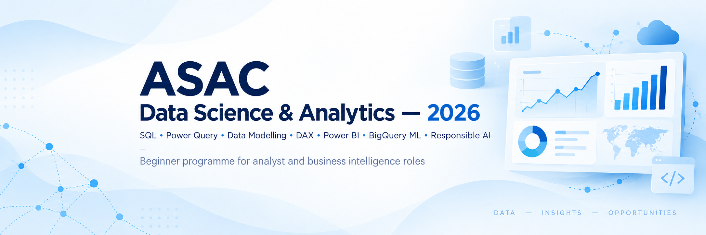
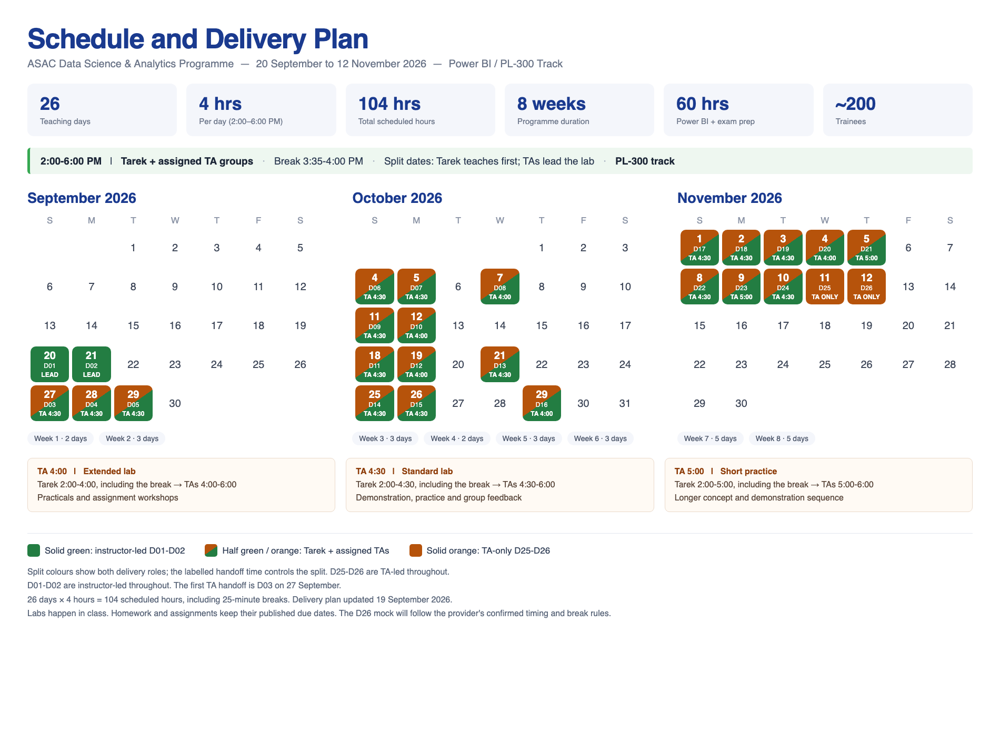

# ASAC Data Science & Analytics — 2026

This beginner programme prepares learners for analyst and business intelligence roles. It combines guided instruction with practical work in SQL, Power Query, data modelling, DAX, report design, introductory machine learning and responsible AI.

**Dates:** 20 September–12 November 2026  
**Class time:** 2:00–6:00 PM (Asia/Amman)  
**Format:** 26 sessions across 8 weeks, for 104 scheduled hours  
**Lead instructor:** Tarek Atwan  
**Cohort:** Approximately 200 trainees

The programme supports preparation for the Microsoft Power BI Data Analyst certification exam (PL-300). Completing the programme does not award Microsoft certification; learners must pass Microsoft's exam to earn it.

## Schedule and delivery plan

[Download the schedule as a PDF](course/assets/schedule.pdf)

[View the student schedule](course/STUDENT_SCHEDULE.md) · [Download the Excel version](course/assets/student-schedule.xlsx) · [Open in Google Sheets](https://docs.google.com/spreadsheets/d/1eese9ddJeecPEWQ60ApRvr0rfiYVBfoNaogoYhwyRNk/edit?usp=sharing)

The scheduled hours include a 25-minute break from 3:35 to 4:00 PM. The final mock exam will follow the timing and break rules confirmed by its provider.

> [!NOTE]
> Course materials will be released weekly before the first session of each new week.

## Course coverage

| Course area | Scheduled hours | Main focus |
|---|---:|---|
| Data foundations | 8 | Analyst roles, data quality, ethics and the Power BI workflow |
| SQL and GitHub | 24 | Querying, joins, CTEs, window functions and portfolio workflow |
| Power Query | 16 | Importing, profiling, cleaning, combining and validating data |
| Data modelling and DAX | 16 | Star schemas, relationships, measures, context and optimisation |
| Visualisation and storytelling | 16 | Report design, accessibility, interaction and presentation |
| Managing and securing Power BI | 4 | Publishing, workspaces, refresh and row-level security |
| Machine learning and responsible AI | 12 | BigQuery ML, model evaluation, Python literacy and responsible use |
| PL-300 review and career readiness | 8 | Structured review, mock practice and next steps |

## How sessions work

Tarek leads concepts and demonstrations. On shared days, he hands the class to the assigned TAs for a structured lab. The schedule uses three delivery markers:

- Solid green: instructor-led throughout
- Split green and orange: instructor-led teaching followed by a TA-led lab; the printed handoff time controls the split
- Solid orange: TA-led throughout

Labs are completed in class. Weekly homework provides about 26 hours of practice outside class. Formal assessment consists of four assignments, two open-book practicals and continuous professional practice; there is no capstone project.

The third-party mock on the final day supports the programme's voucher decision under rules supplied to learners by the programme team. It is separate from the course grade and does not award Microsoft certification.

## Tools and access

| Tool | Use in the programme |
|---|---|
| BigQuery Sandbox | SQL and BigQuery ML |
| GitHub | Portfolio work and version control |
| Power BI Desktop | Power Query, modelling, DAX and report development |
| Power BI Service | Selected publishing and security demonstrations where access permits |

Required trainee work uses free access and does not require a credit card. Power BI Desktop requires access to Windows. If a paid or restricted feature is unavailable, the instructor demonstrates it and provides an equivalent free evidence route.

## Reuse

No public reuse licence has been selected for these materials. Public access to the repository does not grant permission to copy, modify or redistribute its contents.
